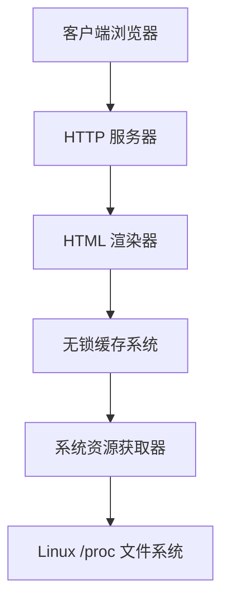

# 资源占用显示系统 - 技术设计文档

## 项目概述

本项目是一个极简的资源占用显示系统，严格按照 `templates/index.html` 设计，专为嵌入式设备监控场景设计。系统支持 200+ 高并发客户端访问，数据更新后 10 秒算过期，无 CSS 无 JS，采用服务器端渲染确保最简实现。

### 核心需求

- **最小最简代码实现**：追求代码简洁性和可维护性
- **高性能，内存占用低**：针对嵌入式设备优化
- **高并发访问，无锁算法**：支持 200+ 并发连接
- **少依赖，尽量使用系统命令**：减少外部依赖
- **数据更新后 10 秒算过期**：数据未过期时无须再次获取
- **无用户访问时无须获取**：按需更新策略
- **无 CSS，无 JS**：纯 HTML 实现
- **严格按照 templates/index.html 设计**：完全遵循设计规范

## 技术架构

### 整体架构图



### 技术栈选择

| 组件       | 选择理由                                 | 替代方案          |
| ---------- | ---------------------------------------- | ----------------- |
| 核心语言   | Rust：内存安全、零成本抽象、优秀并发支持 | Go、C++           |
| Web 框架   | tokio + hyper：最小依赖、高性能          | actix-web、rocket |
| 异步运行时 | tokio：成熟的异步生态                    | async-std         |
| 系统调用   | 直接读取 /proc：零依赖、高性能           | sysinfo crate     |
| 模板引擎   | 简单字符串格式化：无额外依赖             | handlebars、tera  |

## 核心模块设计

### 1. 系统资源获取模块

#### 数据结构

```rust
#[derive(Debug, Clone)]
pub struct SystemStats {
    pub hostname: String,
    pub cpu_usage: f32,           // CPU 使用率 (0.0-1.0)
    pub memory_total: u64,        // 总内存字节数
    pub memory_used: u64,         // 已用内存字节数
    pub memory_available: u64,    // 可用内存字节数
    pub memory_cached: u64,       // 缓存内存字节数
    pub memory_free: u64,         // 空闲内存字节数
    pub timestamp: Instant,       // 数据获取时间戳
}
```

#### 实现策略

1. **Linux 优化路径**：

   - CPU: 读取 `/proc/stat`，计算使用率
   - 内存: 读取 `/proc/meminfo`，获取详细信息
   - 主机名: 读取 `/proc/sys/kernel/hostname`

2. **跨平台支持**：

   ```rust
   #[cfg(target_os = "linux")]
   fn collect_linux_stats() -> Result<SystemStats>

   #[cfg(target_os = "windows")]
   fn collect_windows_stats() -> Result<SystemStats>

   #[cfg(target_os = "macos")]
   fn collect_macos_stats() -> Result<SystemStats>
   ```

3. **性能优化**：
   - 只读取必要的数据字段
   - 使用零拷贝解析技术
   - 避免频繁文件 I/O

### 2. 无锁数据缓存机制

#### 核心设计

```rust
use std::sync::atomic::{AtomicPtr, AtomicU64, Ordering};
use std::time::{Duration, Instant};

pub struct SystemStatsCache {
    current_stats: AtomicPtr<SystemStats>,
    last_update: AtomicU64,
    ttl: Duration,
}

impl SystemStatsCache {
    pub fn new(ttl: Duration) -> Self {
        Self {
            current_stats: AtomicPtr::new(Box::into_raw(Box::new(SystemStats::default()))),
            last_update: AtomicU64::new(0),
            ttl,
        }
    }

    // 无锁读取
    pub fn get(&self) -> Option<SystemStats> {
        let ptr = self.current_stats.load(Ordering::Acquire);
        if ptr.is_null() {
            return None;
        }

        let stats = unsafe { &*ptr };
        let now = SystemTime::now()
            .duration_since(UNIX_EPOCH)
            .unwrap()
            .as_secs();
        let last_update = self.last_update.load(Ordering::Acquire);

        if now - last_update > self.ttl.as_secs() {
            return None; // 数据过期
        }

        Some(stats.clone())
    }

    // 原子更新
    pub fn update(&self, new_stats: SystemStats) {
        let boxed_stats = Box::into_raw(Box::new(new_stats));
        let old_ptr = self.current_stats.swap(boxed_stats, Ordering::Release);

        // 安全释放旧数据
        if !old_ptr.is_null() {
            let _ = unsafe { Box::from_raw(old_ptr) };
        }

        self.last_update.store(
            SystemTime::now()
                .duration_since(UNIX_EPOCH)
                .unwrap()
                .as_secs(),
            Ordering::Release
        );
    }
}
```

#### 缓存更新策略

1. **按需更新策略**：

   ```rust
   // 只有在数据过期且有请求时才更新
   pub async fn get_or_update(&self) -> Result<SystemStats> {
       // 先尝试获取缓存
       if let Some(stats) = self.get() {
           return Ok(stats);
       }

       // 数据过期或不存在，重新获取
       let new_stats = collect_system_stats().await?;
       self.update(new_stats.clone());
       Ok(new_stats)
   }
   ```

2. **惰性更新模式**：
   - 只有在请求时检查数据是否过期
   - 过期时才重新获取系统数据
   - 无用户访问时不会主动获取数据
   - 数据更新后严格 10 秒过期

### 3. 高并发 Web 服务器

#### 服务器架构

```rust
use hyper::{Body, Request, Response, Server};
use hyper::service::{make_service_fn, service_fn};
use std::convert::Infallible;
use std::sync::Arc;

pub struct StatusServer {
    cache: Arc<SystemStatsCache>,
}

impl StatusServer {
    pub async fn new(cache: Arc<SystemStatsCache>) -> Result<Self> {
        Ok(Self { cache })
    }

    pub async fn run(self, addr: SocketAddr) -> Result<()> {
        let cache = self.cache;

        let make_svc = make_service_fn(move |_conn| {
            let cache = cache.clone();
            async move {
                Ok::<_, Infallible>(service_fn(move |req| {
                    let cache = cache.clone();
                    Self::handle_request(req, cache)
                }))
            }
        });

        let server = Server::bind(&addr).serve(make_svc);
        println!("服务器运行在: http://{}", addr);

        if let Err(e) = server.await {
            eprintln!("服务器错误: {}", e);
        }

        Ok(())
    }

    async fn handle_request(
        req: Request<Body>,
        cache: Arc<SystemStatsCache>,
    ) -> Result<Response<Body>, Infallible> {
        match (req.method(), req.uri().path()) {
            (&Method::GET, "/") => Self::serve_html(req, cache).await,
            _ => Self::serve_404(),
        }
    }
}
```

#### 并发优化

1. **连接处理**：

   - 每个连接独立的 async task
   - 无共享状态，只读取缓存
   - 使用 `Arc` 共享只读数据

2. **HTTP 优化**：
   - 启用 HTTP/2 支持多路复用
   - 设置合理的连接超时
   - 静态资源缓存策略

### 4. 前端展示逻辑

#### HTML 模板

严格按照 `templates/index.html` 设计，无 CSS，无 JS，使用 HTML 自动刷新机制。

#### 服务器端渲染

由于无 JavaScript，采用服务器端直接渲染 HTML：

```rust
impl StatusServer {
    async fn serve_html(&self, req: Request<Body>) -> Result<Response<Body>, Infallible> {
        // 获取系统数据
        let stats = match self.cache.get_or_update().await {
            Ok(stats) => stats,
            Err(_) => {
                return Ok(Response::builder()
                    .status(500)
                    .body(Body::from("数据获取失败"))
                    .unwrap());
            }
        };

        // 渲染 HTML 模板
        let html = self.render_html_template(&stats);

        Ok(Response::builder()
            .header("content-type", "text/html; charset=utf-8")
            .body(Body::from(html))
            .unwrap())
    }

    fn render_html_template(&self, stats: &SystemStats) -> String {
        let total_mb = stats.memory_total / 1024 / 1024;
        let used_mb = stats.memory_used / 1024 / 1024;
        let available_mb = stats.memory_available / 1024 / 1024;
        let cached_mb = stats.memory_cached / 1024 / 1024;
        let free_mb = stats.memory_free / 1024 / 1024;

        let cpu_percent = (stats.cpu_usage * 100.0) as u32;

        format!(
            include_str!("../templates/index.html"),
            hostname = stats.hostname,
            cpu_percent = cpu_percent,
            memory_total_mb = total_mb,
            memory_used_mb = used_mb,
            memory_available_mb = available_mb,
            memory_cached_mb = cached_mb,
            memory_free_mb = free_mb
            timestamp = stats.timestamp
        )
    }
}
```

## 性能优化策略

### 内存优化

1. **零拷贝设计**：

   - 字符串操作使用 `Cow<str>` 减少分配
   - HTTP 响应使用流式传输
   - 避免不必要的数据序列化

2. **内存池管理**：

   - 预分配固定大小的缓冲区
   - 重用 `SystemStats` 对象
   - 使用 `Vec::with_capacity()` 预分配容量

3. **栈分配优先**：
   - 小数据结构使用栈分配
   - 避免频繁的堆分配
   - 使用 `#[inline]` 优化小函数

### CPU 优化

1. **计算优化**：

   - CPU 使用率计算使用增量算法
   - 避免浮点数运算，使用定点数
   - 缓存计算结果

2. **I/O 优化**：

   - 使用 `mio` 直接操作 epoll/kqueue
   - 批量读取系统文件
   - 异步文件操作

3. **并发优化**：
   - 无锁数据结构
   - 工作窃取调度
   - CPU 亲和性设置

### 网络优化

1. **协议优化**：

   - HTTP/2 多路复用
   - 启用 TCP_NODELAY
   - 连接池复用

2. **数据压缩**：
   - 静态资源 gzip 压缩
   - JSON 数据精简格式
   - 响应头缓存控制

## 部署和配置

### 编译配置

```toml
[profile.release]
lto = true           # 链接时优化
codegen-units = 1    # 减少代码生成单元
panic = "abort"      # 减少二进制大小
strip = true         # 移除调试符号
```

### 运行时配置

```rust
#[derive(Debug, Clone)]
pub struct Config {
    pub bind_address: String,
    pub port: u16,
    pub cache_ttl: Duration,
    pub update_interval: Duration,
    pub max_connections: usize,
}

impl Default for Config {
    fn default() -> Self {
        Self {
            bind_address: "0.0.0.0".to_string(),
            port: 8080,
            cache_ttl: Duration::from_secs(10), // 严格 10 秒过期
            update_interval: Duration::from_secs(10), // 无后台定时更新
            max_connections: 1000,
        }
    }
}
```

### 系统服务配置

```ini
[Unit]
Description=Resource Status Monitor
After=network.target

[Service]
Type=simple
User=nobody
ExecStart=/usr/local/bin/swb-status-page
Restart=always
RestartSec=5

[Install]
WantedBy=multi-user.target
```

## 测试策略

### 单元测试

- 系统资源获取功能测试
- 缓存机制正确性测试
- 数据结构序列化测试

### 性能测试

- 并发连接压力测试
- 内存使用情况监控
- 响应时间基准测试

### 集成测试

- 端到端功能测试
- 跨平台兼容性测试
- 长时间运行稳定性测试

## 安全考虑

### 输入验证

- HTTP 请求路径验证
- 参数范围检查
- 防止路径遍历攻击

### 资源限制

- 连接数限制
- 请求频率限制
- 内存使用监控

### 错误处理

- 优雅的错误响应
- 敏感信息过滤

## 扩展性设计

### 插件架构

- 可插拔的数据源
- 自定义指标支持
- 第三方集成接口

### 配置管理

- 热重载配置
- 环境变量支持
- 配置文件验证

### 监控和告警

- 健康检查端点
- 指标导出接口
- 告警规则配置

## 开发计划

### 第一阶段：核心功能

1. 实现基础的系统资源获取
2. 构建无锁缓存机制（10 秒过期）
3. 创建极简 HTTP 服务器
4. 实现服务器端 HTML 渲染

### 第二阶段：性能优化

1. 实现高并发处理（200+ 连接）
2. 优化内存使用
3. 完善按需更新策略

### 第三阶段：完善功能

1. 添加配置管理
2. 实现错误处理
3. 完善测试覆盖

### 第四阶段：部署和监控

1. 创建部署脚本
2. 文档完善

## 总结

本设计文档详细描述了资源占用显示系统的技术架构和实现方案。系统采用 Rust 语言，严格按照 `templates/index.html` 设计，无 CSS 无 JS，结合无锁算法和按需更新策略，实现了极简、高性能的监控解决方案。通过服务器端渲染和 10 秒数据过期机制，系统能够在嵌入式设备上稳定运行，支持 200+ 并发客户端访问，同时确保数据未过期时无须再次获取，无用户访问时无须获取。
